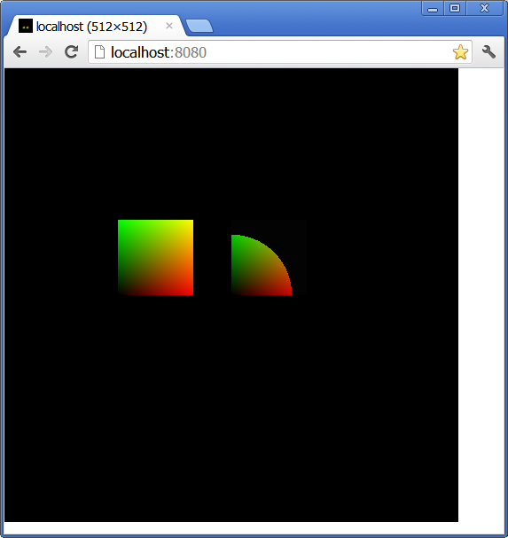
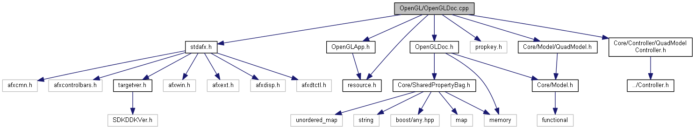
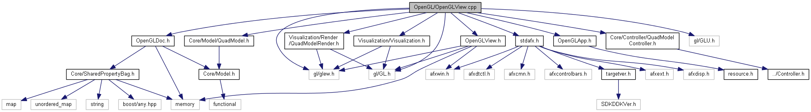
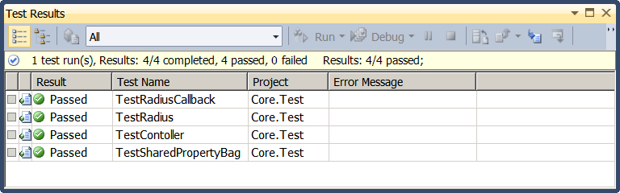
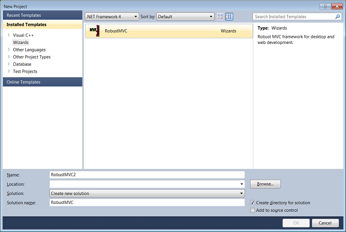

<ul class="download">
<li><a href="Application.zip">Download demo application</a></li>
<li><a href="Webserver.zip">Download demo web server</a></li>
<li><a href="robust_mvc.zip">Download screen-cast of web session</a></li>
<li><a href="RobustMVCWzInstaller.zip">Download wizard installer</a></li>
</ul>

# Introduction
In development of a sizable software product there are a number of
aspects to consider: overall architecture, physical layout, object
lifetime management, maintainability, performance, design
(anti-)patterns and the list goes on. Development can start from a clean slate
and add all the above aspects one by one or start of with a template that
addresses some of these items. But, alas such template does not exist and the ones
that are available tend to focus on one of two of these aspects and take 
shortcuts in the others.

In this article we will explorer a more complete example and provide a
more robust framework that can be adapted to meet further needs.

 
# Real world
Most discussions for creating and application start of with musing about
Model-View-Controller [[MF]], but most native application projects still
start of from MFC template that has a Document-View "architecture".
Things tend to move downhill from there and after a while business logic
is intertwined with presentation and physical layout is intertwined with
MFC. Sprinkle couple more external libraries and you've got a big
monolithic code base with ever increasing build times and requiring more
and more heroic effort to resolve issues or introduce new functionality.
Side note, a managed application templates are not much better, but
check out my other article on managed application/WCF [[wcf
technobabble]]. 

[MF]: http://martinfowler.com/eaaCatalog/modelViewController.html "MVC"
[wcf technobabble]: http://www.codeproject.com/Articles/107807/REST-Technobabble

# Robust Model-View-Controller
A few innovations were identified to improve upon the
Model-View-Controller [[MVVM], [MVP]], but it seems much more important to
improve the way MVC is integrated with the platform/library used the
build the application. More over, application today are rarely involve just one
platform, some parts run on desktop and some are executed on the backed (or on one
of its tiers). So the integration approach shall allow to reuse the
*actual* model and controller implementation across several platforms.
Implementation for view(s) are generally more dependent on the 
presentation/look-n-feel/visualization technology so trying to get the same 
implementation for the presentation logic is generally not worth the effort. But 
with model/controller logic out of the way, it becomes much more straightforward 
to re-implement the view (but see below how simplify that task by re-using 
visualization building blocks) for the appropriate platform.

[MVVM]: http://en.wikipedia.org/wiki/Model_View_ViewModel
[MVP]: http://en.wikipedia.org/wiki/Model%E2%80%93view%E2%80%93presenter
 
# The scope
So let's define the scope that would be covered in this example.
Reminder, we want to cover something reasonably complex, as to not skip
important aspects. Let's do something graphical, something using OpenGL, 
better yet lets use something a bit more recent -- shaders. Usually
applications are not build from scratch, so let's use some external
libraries and see how that fits in: [Boost] is a popular one, as well
as [GLEW] to help out with OpenGL. How about maintainability and 
physical layout: establish separate modules for corresponding 
functionality and allow to build unit tests as well allow reuse in other 
projects.

[Boost]: http://www.boost.org/
[GLEW]: http://glew.sourceforge.net/

Now let's pick the actual platform and actually define parts that will be
platform independent. Model and Controller shall be platform independent. 
The rendering of views will be OpenGL and as it is cross platform, 
we'll keep the rendering part cross platform as well.

Now the application itself -- the glue that initializes and binds everything 
together (note, it's binding, not much else).
We will actually setup two of these: one will use MFC while the other will be a standalone
http webserver. Why to choose [MFC], because **you** most likely already know 
the good and pain points about it. Why target a stand alone webserver, 
obviously because web connected frameworks extremely useful. But also 
because it is diametrically opposite of a desktop MFC application, so that 
should show robustness of the approach.

[MFC]: http://msdn.microsoft.com/en-us/library/ws8s10w4(v=vs.100).aspx

To top it off, documentation shall be generated automatically and (if we
get time) source code analysis and code coverage.

# Preview #
Sometimes it's better to start off with desert, in this case let's look at snapshots:

<table>
<tr>
<td>

</td>
<td>

</td>
</tr>

<tr>
<td>
Application using OpenGL shaders
</td>
<td>
Webserver and Chrome browser
</td>
</tr>
</table>

Below is a screen cast using the web server. Note, the radius is increased/decreased until specified limits are reacheds. 
The limits are enforced by the controller. 

<video autoplay="autoplay" controls="controls">
  <source src="https://raw.github.com/okigan/RobustMVC/master/Documentation/robust_mvc.mp4">
  Your browser does not support the video tag.
</video>

# Integration
Below is a snapshot of desktop integration, with corresponding areas highlighted. Note the following key area: 

- The Model and Controller have no dependencies on the gluing coded (MFC).
- The gluing code has minimal dependencies on the Model, Controller.
- Modification to the model can only be performed by Controller (i.e. the model can be retrieved from document only as const). 
- The view class only deals with initialization of the graphic pipeline and delegates the rest of rending to the ModelRender class. 

The two diagrams below physical layout of the project, with following areas of interest:

- The Model and Controller have no dependencies on the gluing code. This point is similar to one in prior section, but on physical structure level. 
- The Model and Controller have not dependencies on the viewing code.
- In the gluing code the Document has no dependencies on the graphic api (OpenGL) used for visualization

# Graphcs
The example in this article targets [OpenGL 2.1] and [GLSL 1.20] shaders. The selection for this version of OpenGL/GLSL 
is mainly to ensure it can be executed on the "run of the mill" hardware (and actually this will run on bare bones 
Intel embeded graphics, which is common in today's laptops). At the same time, this will cover following important aspects: 

- OpenGL context initialization
- Usage of GLSL shaders with uniforms' values based on the model
- Multiple views sharing the same OpenGL context
- OpenGL context teardown when **all** the views are closed
- Separate context for each document/model to enforce consistency

[OpenGL 2.1]: http://en.wikipedia.org/wiki/OpenGL#OpenGL_2.1
[GLSL 1.20]: http://en.wikipedia.org/wiki/OpenGL_Shading_Language#Versions

The drawing effectively is a quad drawn using OpenGL's fixed pipeline, and then a second quad clipped 
by radius of value specified in the model. The clipping is done using GLSL shader, which is kept pretty simple:

    GLchar* vSource = 
        "varying float x;                                                               \r"
        "varying float y;                                                               \r"
        "void main() {                                                                  \r"
        "   gl_Position = gl_ModelViewProjectionMatrix * gl_Vertex;                     \r"
        "   gl_FrontColor = gl_Vertex;                                                  \r"
        "   x = gl_Vertex.x;                                                            \r"
        "   y = gl_Vertex.y;                                                            \r"
        "}                                                                              \r"
    ;

    GLchar* fSource = 
        "uniform float radius;                                                          \r"
        "varying float x;                                                               \r"
        "varying float y;                                                               \r"
        "void main()                                                                    \r"
        "{                                                                              \r"
        "    float r = sqrt(x*x + y*y);                                                 \r"
        "    if( r <= radius ) {                                                        \r"
        "        gl_FragColor = gl_Color;                                               \r"
        "    } else  {                                                                  \r"
        "        gl_FragColor = vec4(0.01, 0.01, 0.01, 1);                              \r"
        "   }                                                                           \r"
        "}                                                                              \r"
    ; 

#Unit Test and Test coverage
This section shows snapshots for unit test reports as well as coverage attained with the unit tests:

# Installation
And in conclusion to the best part: all of the above can be reasonably reused though a new Visual Studio **Wizard**. To install you can navigate to the [Visual Studio Gallery](http://visualstudiogallery.msdn.microsoft.com/83b0439b-c380-4d08-992d-efcf7f459f90?SRC=VSIDE), use Visual Studio as shown below or download installer at the top:

Open the new project dialog in Visual Studio.
Type in the search term: "igor okulist".
Select the "Robust MVC" item, and proceed installation.
If everything works, you should see a dialog as the one shown below:

After the installation the new project dialog will have new **Wizard** category:

# Summary
The article presents key points on implementing and integrating Model-View-Controller framework into existing application development framework. The approach maintains minimal dependencies and facilitates cross platform development. Additionally the same Model-View-Controller implementation is integrated with a web server that allows to the same model \[rendering\] through a web browser.

# FAQ

- Q: Where is the source?!
- A: <strike>Still being prepared. Bookmark, vote or post comments to help me prioritize vs my other hobby projects. By the way contact me if you have experience with making **C++ Wizards** for Visual Studio 2010.</strike> Download the wizard installer and start making new projects based on this framework!

# See also
- [Reliable Software Win32 MVC implementation](http://www.relisoft.com/win32/generic.html)
- [The SBJ MVC Framework](http://www.codeproject.com/Articles/31190/The-SBJ-MVC-Framework-The-Model-from-Abstraction-t)
